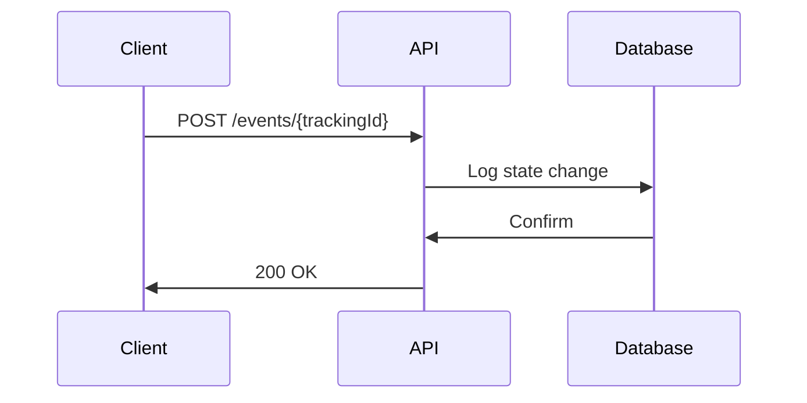

## Overview

Biz Intel Marketing provides a unified platform for managing logistics and marketing operations. You gain real-time visibility into shipments, campaigns, and customer interactions through core principles like persistent tracking identities and comprehensive audit trails. These concepts ensure that every event contributes to a single source of operational truth, eliminating fragmented data across systems.

<Callout kind="info">
Biz Intel Marketing treats every tracking ID as a unique, persistent identity that follows the item or campaign from origin to completion.
</Callout>

## Key Concepts

Use these foundational ideas to build reliable workflows.

<Columns cols={3}>
  <Card title="Persistent Tracking ID" icon="search" href="#persistent-tracking">
    Assign a unique ID that maintains identity across all systems and stages.
  </Card>
  <Card title="State Changes & Logging" icon="git-branch" href="#state-changes">
    Capture every transition with automatic event logging for full traceability.
  </Card>
  <Card title="Audit Trails" icon="file-text" href="#audit-trails">
    Detect anomalies and maintain verifiable histories without manual effort.
  </Card>
</Columns>

<Columns cols={2}>
  <Card title="Unified Data Flow" icon="arrow-right" href="#unified-flow">
    Stream data seamlessly from origin to delivery or conversion.
  </Card>
  <Card title="Operational Truth" icon="shield" href="#operational-truth">
    Integrate systems for consistent, real-time decision-making.
  </Card>
</Columns>

## Persistent Tracking ID

Every logistics item or marketing lead starts with a `trackingId` that acts as its persistent identity. You use this ID across APIs, dashboards, and integrations to reference the same entity consistently.

```javascript
const trackingId = "DK-A93F21"; // Persistent across all events
```

This prevents duplication and ensures data integrity.

<CodeGroup tabs="JavaScript,Python">
```javascript
// Fetch tracking details
const response = await fetch(`https://api.example.com/v1/tracking/${trackingId}`);
const data = await response.json();
console.log(data.status); // "In Transit"
```

```python
import requests

tracking_id = "DK-A93F21"
response = requests.get(f"https://api.example.com/v1/tracking/{tracking_id}")
data = response.json()
print(data["status"])  # "In Transit"
```
</CodeGroup>

## State Changes and Event Logging

Track state transitions like "Pending" to "In Transit" or "Lead" to "Qualified". Biz Intel Marketing logs each change automatically.



<Steps>
  <Step title="Log a State Change" icon="edit-3">
    Send an event to update status.
  </Step>
  <Step title="Verify Log" icon="check-circle">
    Query the audit trail for confirmation.
  </Step>
  <Step title="Handle Anomalies" icon="alert-triangle">
    Review detected inconsistencies.
  </Step>
</Steps>

## Audit Trails and Anomaly Detection

Maintain a tamper-proof history of all actions. The system flags anomalies like unexpected state jumps.

<ParamField path="trackingId" param-type="string" required="true">
  Persistent identifier for the entity.
</ParamField>

<ResponseField name="events" field-type="array" required="true">
  Array of logged events with timestamps.
</ResponseField>

<ResponseField name="anomalies" field-type="array">
  Detected issues, e.g., unauthorized changes.
</ResponseField>

## Unified Data Flow

Data flows from origin (shipment pickup or lead capture) to delivery (final status or conversion) without silos.

<Tabs>
  <Tab title="Logistics Flow" icon="truck">
    Pick up → Warehouse → Customs → Delivery.
  </Tab>
  <Tab title="Marketing Flow" icon="activity">
    Lead Capture → Qualification → Nurture → Conversion.
  </Tab>
</Tabs>

## Operational Truth and Integration

Achieve a single source of truth by integrating disparate systems. You configure webhooks to sync external data.

<Expandable title="Advanced Integration Example" default-open="false">
  Set up a webhook endpoint to receive real-time updates.

````javascript
// Webhook handler
app.post('/webhook', (req, res) => {
  const { trackingId, event } = req.body;
  // Process and store
  console.log(`Event for {trackingId}: {event.type}`);
  res.status(200).send('OK');
});
````
</Expandable>

<Callout kind="tip">
Start with the [Quickstart](/quickstart) to implement your first tracking ID.
</Callout>