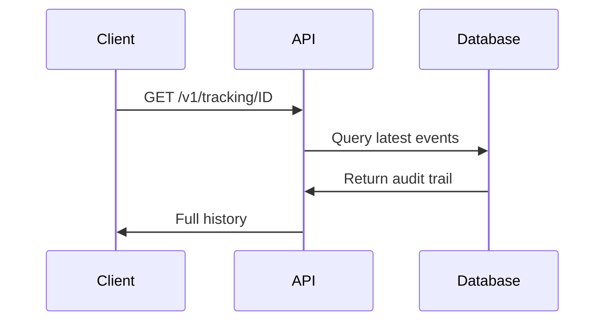

<Callout kind="info" title="Starter Kit Template">
  This documentation was generated as a starter kit template based on your brand. Please review and customize the content to accurately reflect your product's features, APIs, and capabilities.
</Callout>

## Overview

Biz Intel Marketing provides real-time infrastructure for traceability, audit, and operational control in global logistics. It treats each tracking ID as a unique operational identity, connecting shipments, events, and statuses into a single auditable flow.

You gain complete visibility across warehouses, customs, billing, and delivery without fragmented records or manual reconciliation. Eliminate assumptions and achieve operational truth with automated verification of every state change.

## Key Features

<Columns cols={3}>
  <Card title="Real-time Traceability" icon="zap" href="#core-capabilities">
    Track millions of shipments instantly across multiple systems and locations.
  </Card>
  <Card title="Automated Audit Trail" icon="shield" href="#core-capabilities">
    Capture every transition and detect inconsistencies in real time.
  </Card>
  <Card title="Unified Operational Truth" icon="database" href="#benefits">
    One persistent history per tracking ID, eliminating data silos.
  </Card>
</Columns>

## Core Capabilities

### Real-time Traceability
Monitor shipment status updates as they happen. Query any tracking ID to retrieve current location, status, and full history.

<CodeGroup tabs="JavaScript,cURL">
  ```javascript
  const response = await fetch('https://api.example.com/v1/tracking/DK-A93F21', {
    headers: { Authorization: `Bearer ${YOUR_API_KEY}` }
  });
  const data = await response.json();
  console.log(data.status); // "In Transit"
  ```
  ```bash
  curl -H "Authorization: Bearer YOUR_API_KEY" \
       https://api.example.com/v1/tracking/DK-A93F21
  ```
</CodeGroup>

### Audit and Verification
Every change is logged with timestamps and actors. Verify who updated what and when.



## Benefits for Logistics Operations

Unify tracking, billing, and delivery data to prevent failures from system disagreements. Process over `$10M+` annually with `2.5M+` trackings and `3M+` searches per year.

<Callout kind="tip">
  Start with a test tracking ID like `DK-A93F21` to explore the dashboard at `https://dashboard.example.com`.
</Callout>

## Quick Start

<Steps>
  <Step title="Sign Up" icon="user-plus">
    Create your account at `https://dashboard.example.com/register`.
  </Step>
  <Step title="Get API Key" icon="key">
    Navigate to Settings > API Keys and generate `YOUR_API_KEY`.
  </Step>
  <Step title="Track First Shipment" icon="search">
    Use the example code above to query a tracking ID.
  </Step>
</Steps>

## Next Steps

<Columns cols={2}>
  <Card title="Quickstart Guide" icon="book-open" href="/quickstart">
    Set up your first integration in minutes.
  </Card>
  <Card title="Authentication" icon="lock" href="/authentication">
    Secure your API access properly.
  </Card>
  <Card title="API Reference" icon="code" href="/api-reference">
    Full endpoint documentation.
  </Card>
  <Card title="Changelog" icon="git-branch" href="/changelog">
    Stay updated with latest releases.
  </Card>
</Columns>

<Callout kind="success">
  Ready to dive deeper? Check the <a href="/quickstart">Quickstart</a> for hands-on setup.
</Callout>